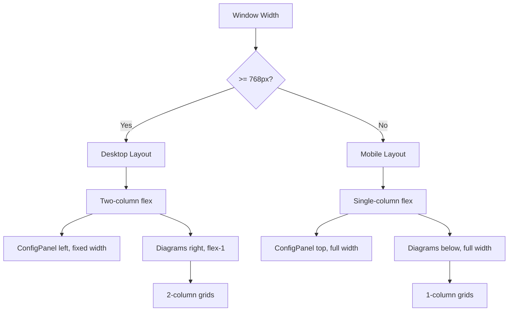

# Responsive Mobile Layout Plan

## Overview
Implement a responsive layout variant for narrow vertical screens (smartphones) in the Longboard Simulator Vite/React app.

## ⚠️ Scaling Code Interference Analysis

### SideView & FrontView Height Coupling

**Current implementation (App.tsx lines 173-237):**
```tsx
const diagramsRowRef = useRef<HTMLDivElement | null>(null)
const [diagramHeightPx, setDiagramHeightPx] = useState<number>(280)

// ResizeObserver measures the 2-column grid container
useEffect(() => {
  const el = diagramsRowRef.current
  // ... measures el.getBoundingClientRect().height
}, [])

const sharedViewHeightPx = Math.max(220, diagramHeightPx)
const sharedGroundOffsetPx = Math.max(22, Math.min(50, Math.round(sharedViewHeightPx * 0.1)))
```

**Problem:** On mobile (single column), the grid container becomes much taller because components stack vertically. The ResizeObserver will measure this increased height and produce incorrect `sharedViewHeightPx` values.

**Solution:** Use a fixed height on mobile, or compute height based on viewport width instead of container height.

### TopView

**No interference.** TopView uses:
- Fixed `width={640}` and `height={256}` props
- SVG `viewBox` handles responsive scaling automatically
- Has independent `ICR_VIEW_SCALE` — not coupled to shared scale

### SideView

**Interference:** Uses `height={sharedViewHeightPx}` which depends on the broken ResizeObserver logic on mobile.

---

## Current Layout Structure
```
┌─────────────────────────────────────────────────────────────┐
│ Header                                                       │
├──────────────┬──────────────────────────────────────────────┤
│              │  Truck Diagrams                              │
│  ConfigPanel │  ┌─────────────┬─────────────┐              │
│   (w-96)     │  │  SideView   │  FrontView  │              │
│              │  └─────────────┴─────────────┘              │
│              │  ┌─────────────┬─────────────┐              │
│              │  │  TopView    │ LeanVsSteer │              │
│              │  ├─────────────┼─────────────┤              │
│              │  │ RotStiff    │ SteerMoment │              │
│              │  ├─────────────┼─────────────┤              │
│              │  │ BushTorque  │             │              │
│              │  └─────────────┴─────────────┘              │
│              │  ┌─────────────┬─────────────┐              │
│              │  │ TurnRadius  │ Centripetal │              │
│              │  └─────────────┴─────────────┘              │
└──────────────┴──────────────────────────────────────────────┘
```

## Target Mobile Layout (Single Column)
```
┌─────────────────────┐
│ Header               │
├─────────────────────┤
│ ConfigPanel           │
│ (collapsible/accordion) │
├─────────────────────┤
│ SideView              │
├─────────────────────┤
│ FrontView             │
├─────────────────────┤
│ TopView               │
├─────────────────────┤
│ LeanVsSteerChart      │
├─────────────────────┤
│ LeanVsRotationalStiff │
├─────────────────────┤
│ SteeringMomentChart   │
├─────────────────────┤
│ LeanVsBushingTorque   │
├─────────────────────┤
│ LeanVsTurningRadius   │
├─────────────────────┤
│ LeanVsCentripetalAxis │
└─────────────────────┘
```

## Breakpoint Strategy

**Recommended approach: Tailwind CSS responsive utilities**

Use Tailwind's `md:` breakpoint (768px) as the switching point:
- **Below 768px**: Single column mobile layout
- **768px and above**: Two-column desktop layout

This is the most common approach for React/Tailwind apps because:
1. No JavaScript required for layout switching
2. Automatic response to window resizing
3. Consistent with Tailwind's mobile-first design philosophy
4. No additional state management needed

### Alternative: Manual Toggle (Not Recommended)
A manual toggle button could be added, but this adds complexity and is generally unnecessary when CSS can handle it automatically. Users expect responsive behavior on mobile devices.

## Implementation Details

### 1. Main Layout Container Changes

**Current (App.tsx line 316):**
```tsx
<div className="flex flex-1 overflow-hidden">
  <aside className="w-96 flex-shrink-0 border-r border-gray-800 overflow-y-auto">
    <ConfigPanel ... />
  </aside>
  <main className="flex-1 overflow-y-auto p-4 space-y-4">
    ...
  </main>
</div>
```

**Proposed:**
```tsx
<div className="flex flex-col md:flex-row flex-1 overflow-hidden">
  <aside className="w-full md:w-96 md:flex-shrink-0 border-b md:border-b-0 md:border-r border-gray-800 overflow-y-auto">
    <ConfigPanel ... />
  </aside>
  <main className="flex-1 overflow-y-auto p-4 space-y-4">
    ...
  </main>
</div>
```

### 2. Diagram Grid Changes

**Current (2-column grid):**
```tsx
<div className="grid grid-cols-2 gap-4">
  <SideView ... />
  <FrontView ... />
</div>
```

**Proposed (responsive grid):**
```tsx
<div className="grid grid-cols-1 md:grid-cols-2 gap-4">
  <SideView ... />
  <FrontView ... />
</div>
```

### 3. Chart Grid Changes

Apply `grid-cols-1 md:grid-cols-2` to all chart grid containers.

### 4. Fix ResizeObserver for Mobile Heights

**Critical:** The existing `ResizeObserver` logic for `sharedViewHeightPx` must be modified for mobile.

**Problem:** On mobile, SideView and FrontView stack vertically. The current ResizeObserver measures the combined container height, which becomes incorrect when components are in a single column.

**Solution options:**

**Option A: Fixed height on mobile (simplest, recommended)**
```tsx
// Use fixed height on mobile, dynamic on desktop
const isMobile = window.innerWidth < 768
const sharedViewHeightPx = isMobile ? 280 : Math.max(220, diagramHeightPx)
```

**Option B: Separate height tracking per view**
Use individual ResizeObservers for each view container, or compute height based on viewport width:
```tsx
// Height proportional to viewport width on mobile
const mobileHeight = Math.min(400, window.innerWidth * 0.7)
```

**Option C: Aspect ratio approach**
Keep the SVG viewBox dimensions fixed, let CSS handle responsive sizing:
```tsx
<div className="aspect-video">
  <SideView width={500} height={280} ... />
</div>
```

**Recommended:** Option A for simplicity. The views will have consistent heights on mobile.

### 5. ConfigPanel Mobile Considerations

On mobile, the ConfigPanel may take significant vertical space. Consider:
- Making it collapsible/accordion-style on mobile
- Adding a "Show/Hide Configuration" toggle button
- Using a drawer/slide-out pattern

**Simple approach:** Keep it visible but add visual separation. Users can scroll past it to see charts.

## Files to Modify

| File | Changes |
|------|---------|
| `src/App.tsx` | Main layout restructuring, responsive grid classes, **fix ResizeObserver logic for mobile** |
| `src/components/ConfigPanel.tsx` | Optional: collapsible behavior for mobile |
| `src/components/SideView.tsx` | No changes needed (viewBox handles scaling) |
| `src/components/FrontView.tsx` | No changes needed (viewBox handles scaling) |
| `src/components/TopView.tsx` | No changes needed (viewBox handles scaling) |
| Chart components | No changes needed (Plotly handles responsive sizing) |

**Note:** The SVG components already use `width="100%"` with `viewBox`, so they scale correctly. The issue is only with the `sharedViewHeightPx` computation in App.tsx.

## Testing Checklist

- [ ] Layout switches at 768px breakpoint
- [ ] All components visible and usable on 375px width (iPhone SE)
- [ ] All components visible and usable on 414px width (iPhone 14 Pro Max)
- [ ] ConfigPanel accessible on mobile
- [ ] Charts remain readable on narrow screens
- [ ] SVG diagrams scale appropriately
- [ ] SideView and FrontView heights are correct on mobile
- [ ] No horizontal scrolling on mobile
- [ ] Tour overlays work correctly on mobile

## Mermaid Diagram: Layout Decision Flow


