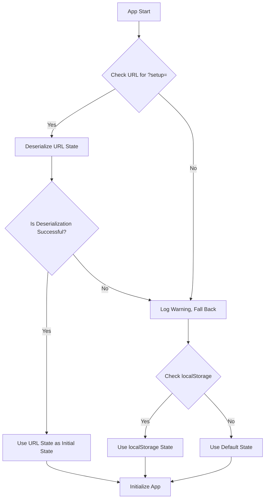

# Architectural Plan: URL-Based State Sharing

## Overview
This document outlines the strategy for implementing URL-based state sharing in the Longboard Simulator. This feature allows users to share their specific board setups and configurations via a shareable link, without overwriting their existing local preferences.

## 1. State Serialization & Deserialization (`src/utils/urlState.ts`)
We need a robust way to convert the application state into a URL-safe string and back.
- **Serialization**: 
  - Extract the relevant state: `setups`, `activeSetupId`, and `riderParams`.
  - Convert this object to a JSON string.
  - Encode the JSON string using URL-safe Base64 encoding: `btoa(JSON.stringify(state)).replace(/\+/g, '-').replace(/\//g, '_').replace(/=/g, '')`. This avoids extra dependencies while keeping the URL relatively compact.
- **Deserialization**:
  - Read the `setup` query parameter from the URL.
  - Reverse the encoding process (pad with `=`, replace `-` with `+` and `_` with `/`, then `atob`).
  - Parse the resulting JSON string back into the state object.
  - Include error handling (`try...catch`) to gracefully fall back to `localStorage` or defaults if the URL data is corrupted or invalid.

## 2. Application Initialization Logic (`src/App.tsx`)
The initialization sequence in `App.tsx` needs to be updated to prioritize the URL state.
- **Current Flow**: `localStorage` → Defaults.
- **New Flow**: 
  1. Check `window.location.search` for the `?setup=` parameter.
  2. If present and valid, deserialize it and use it as the initial state. **Crucially, do not save this deserialized state back to `localStorage` immediately**, to respect the user's existing saved preferences.
  3. If not present or invalid, fall back to the existing `localStorage` → Defaults logic.
- **State Management**: The `setups`, `activeSetupId`, and `riderParams` state variables will be initialized with this resolved state.

## 3. UI Integration: Share Button
A user-friendly way to generate and copy the shareable link is needed.
- **Location**: A "Share" button in the main header or within the `ConfigPanel.tsx` (e.g., next to the "Duplicate" or "Delete" buttons) is appropriate.
- **Action**: 
  - On click, serialize the current state (`setups`, `activeSetupId`, `riderParams`).
  - Construct the full shareable URL: `window.location.origin + window.location.pathname + '?setup=' + serializedState`.
  - Use the `navigator.clipboard.writeText()` API to copy the URL to the user's clipboard.
  - Provide visual feedback (e.g., a temporary "Copied!" tooltip or button text change).

## 4. Dynamic URL Updating (Optional but Recommended)
To make the sharing experience seamless, the URL should update automatically as the user makes changes, without triggering a page reload.
- **Implementation**: Use `window.history.replaceState(null, '', newUrl)` whenever the state (`setups`, `activeSetupId`, or `riderParams`) changes.
- **Debouncing**: To avoid excessive history updates and performance hits, debounce this operation (e.g., 500ms after the last change).
- **Caveat**: This should only be done if the user originally loaded the page with a `?setup=` parameter, or after they explicitly click "Share" for the first time, to avoid polluting the history of users who just want to use the app locally.

## 5. Testing (`src/utils/__tests__/urlState.test.ts`)
Robust testing is essential for serialization logic.
- **Round-trip Test**: Verify that `deserializeState(serializeState(originalState))` deeply equals `originalState`.
- **Edge Cases**: Test with empty states, states with special characters in setup names, and invalid/corrupted URL parameters to ensure graceful fallback.

## Mermaid Diagram: Initialization Flow

## Next Steps
1. Create `src/utils/urlState.ts` and `src/utils/__tests__/urlState.test.ts`.
2. Update `src/App.tsx` initialization logic.
3. Add the "Share" button to the UI.
4. (Optional) Implement dynamic URL updating with debouncing.