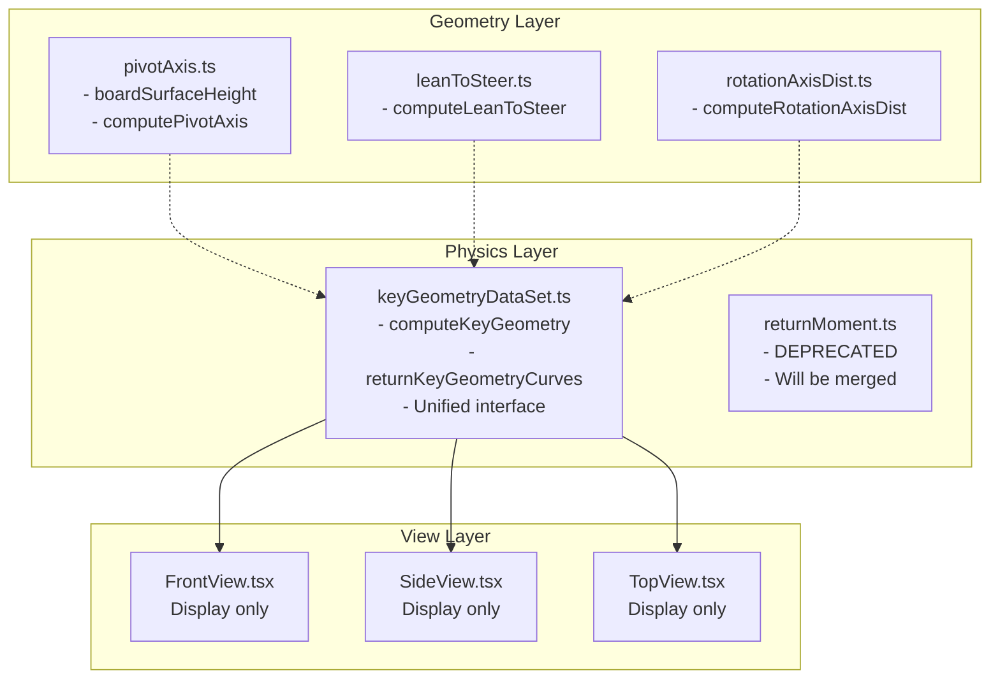

# Refactoring Plan: FrontView.tsx, SideView.tsx, and keyGeometryDataSet.ts

## Executive Summary

This plan addresses the refactoring of geometry computations from `FrontView.tsx` and `SideView.tsx` into `keyGeometryDataSet.ts` to ensure:
- All geometry computations done in exactly one place
- All hardcoded geometry values defined in keyGeometryDataSet.ts (except display-only values)
- Views only display precomputed data

---

## Issues Identified

### 1. Duplicate invPendulumHeight Formulas (Conflict)

| File | Formula | Includes boardThicknessMm |
|------|--------|------------------------|
| keyGeometryDataSet.ts (line 152-153) | `axleToBaseplateDistance + baseplateToBoard - rake / cos(α)` | ❌ No |
| returnMoment.ts (line 141) | `axleToBaseplateDistance + baseplateToBoard - rake / cos(α)` | ❌ No |
| FrontView.tsx (line 154-158) | `baseplateToBoard + boardThicknessMm + axleToBaseplateDistance - rake / cos(α)` | ✅ Yes |
| SideView.tsx (line 182-186) | Same as FrontView | ✅ Yes |

**Resolution**: Include boardThicknessMm in invPendulumHeight formula (per user clarification).

---

### 2. Mysterious 0.25 Factor in FrontView.tsx (Line 145)

```javascript
invPendulumHeight = 0.25*closestEntry.invPendulumHeight
```

**Resolution**: Remove the 0.25 factor (per user clarification).

---

### 3. Conflicting CenterOfForce Formulas

| File | centerOfForceZ Formula |
|------|-------------------|
| keyGeometryDataSet.ts (line 183) | `-bushingTorqueNm * (1000 / riderForce)` |
| returnMoment.ts (line 148) | `bushingTorqueNm / riderForce` |

**Resolution**: keyGeometryDataSet.ts formula is correct. Update returnMoment.ts code to handle sign flip.

---

### 4. Duplicate Files with Overlapping Functionality

- `keyGeometryDataSet.ts` - Has ICR computation
- `returnMoment.ts` - Missing ICR, simpler

**Resolution**: Merge into superset in keyGeometryDataSet.ts.

---

### 5. Hardcoded Values to Extract

#### FrontView.tsx:
- `wheelOffset = 14` (mm)
- `wheelWidthMm = 52` (mm)  
- `boardHalfWidth = 100` (mm)

#### SideView.tsx:
- `geometryWidthMm = 200` (mm)

These should be moved to keyGeometryDataSet.ts or passed as props (display-only).

---

## Proposed Architecture



---

## Implementation Steps

### Phase 1: Fix Core Formulas (Prerequisite)

1. **Fix keyGeometryDataSet.ts invPendulumHeight**
   - Update line 152-153, 269 to include boardThicknessMm parameter
   - Formula: `axleToBaseplateDistance + baseplateToBoard + boardThicknessMm - rake / cos(α)`

2. **Fix FrontView.tsx**
   - Remove 0.25 factor (line 145)
   - Use correct formula: `baseplateToBoard + boardThicknessMm + axleToBaseplateDistance - rake / cos(α)`

3. **Fix returnMoment.ts sign handling**
   - Update any dependent code to handle sign flip
   - Align with keyGeometryDataSet.ts formula

### Phase 2: Merge returnMoment.ts into keyGeometryDataSet.ts

1. Move any unique functions from returnMoment.ts to keyGeometryDataSet.ts
2. Export the merged superset  
3. Mark returnMoment.ts as deprecated
4. Update all imports

### Phase 3: Extract Hardcoded Values

1. Add to keyGeometryDataSet.ts:
```typescript
// Default visualization constants (display-only)
export const DEFAULT_WHEEL_OFFSET_MM = 14
export const DEFAULT_WHEEL_WIDTH_MM = 52
export const DEFAULT_BOARD_HALF_WIDTH_MM = 100
export const DEFAULT_GEOMETRY_WIDTH_MM = 200
```

2. Pass as optional props to views instead of hardcoding

### Phase 4: Update Views

1. **FrontView.tsx**
   - Import precomputed values from keyGeometryCurves
   - Remove inline invPendulumHeight calculation (lines 154-159)
   - Use keyGeometryCurves[].invPendulumHeight directly
   - Remove inline centerOfBoard/centerOfForce calculations

2. **SideView.tsx**
   - Remove inline invPendulumHeight calculation (lines 182-186)
   - Use keyGeometryCurves or pass via props

### Phase 5: Verification

1. Compare rendered output before/after
2. Verify equations match across files
3. Check for regressions in charts and graphs

---

## Files to Modify

| File | Changes |
|------|--------|
| `src/physics/keyGeometryDataSet.ts` | Add boardThicknessMm parameter, extract constants |
| `src/physics/returnMoment.ts` | Mark deprecated, align signs |
| `src/components/FrontView.tsx` | Remove 0.25 factor, use precomputed values |
| `src/components/SideView.tsx` | Use precomputed values |
| `src/App.tsx` | Update keyGeometryCurves computation |

---

## Next Steps

1. User reviews and approves this plan
2. Proceed to Phase 1: Fix core formulas
3. Present intermediate results for verification

---

## Questions for User

- Should the hardcoded values (wheelOffset, wheelWidthMm, etc.) be in keyGeometryDataSet.ts as exported constants, or passed as props to views?
- Are there any existing test files I should run for verification?